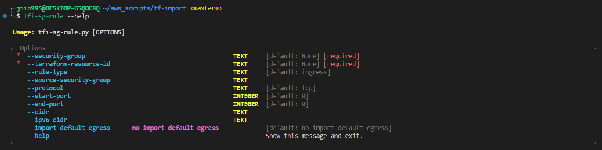

<a name="readme-top"></a>

<div align="center">

  
  <br/>

  <h3><b>tfi: tf-import</b></h3>

</div>

# 📗 Table of Contents

- [📖 About the Project](#about-project)
- [💻 Getting Started](#getting-started)
  - [⚒ Usage](#usage)
- [👥 Authors](#authors)
- [🔭 Future Features](#future-features)
- [🤝 Contributing](#contributing)
- [❓ FAQ](#faq)

# 📖 TFI <a name="about-project"></a>

> A collection of useful scripts for import AWS resources in terraform in easy way.
This repo contains script, installed as shell alias to perform import of resources

Supported resources:

| **Terraform Resource**       | **Command**                                 |
|------------------------------|---------------------------------------------|
| aws_security_group_rule      |  tfi-sg-rule                                |

<p align="right">(<a href="#readme-top">back to top</a>)</p>

<!-- GETTING STARTED -->

## 💻 Getting Started <a name="getting-started"></a>

1. Run `./install.sh`

### ⚒️ Usage <a name="usage"></a>

For each command use `--help` flag to find out its usage!

<div align="center">
  
</div>

### 🔄 Update <a name="update"></a>

For update run

```Bash
git pull
./install.sh
```

<p align="right">(<a href="#readme-top">back to top</a>)</p>

## 👥 Authors <a name="authors"></a>

- **Gabriele Previtera**: [@jiin995](https://gitlab.com/jiin995)

<p align="right">(<a href="#readme-top">back to top</a>)</p>

## 🔭 Future Features <a name="futurecd-features"></a>

Add more scripts with beautiful readme!

<p align="right">(<a href="#readme-top">back to top</a>)</p>

## ❓ FAQ <a name="faq"></a>

- **When trying to import, i have the following error 'Cannot import non-existent remote object'**

  - Ensure that use aws profile that manage resource that you would import. Run command prefixing **AWS_PROFILE=profile_name** before tfi command.
